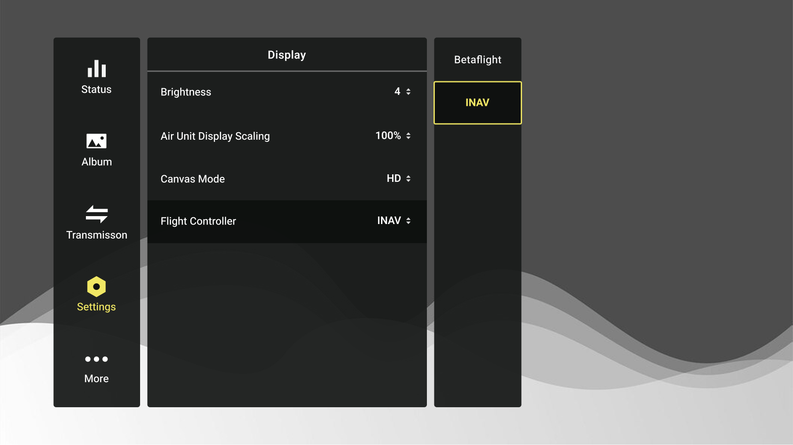

# обновление очков для полноценного INAV OSD

<figure markdown="span">
  { width="100%" } 
  <figcaption>OSD</figcaption>
</figure>

| **девайс**      | **версия прошивки** |
|:----------------|--------------------:|
| O4 & O4 Pro     | v01.00.02.00        |
| Goggles 3       | v01.00.08.00        |
| Goggles 2       | v01.12.00.00        |
| Goggles integra | v01.08.00.00        |
| Goggles N3      | v01.00.04.00        |

## Описание релиза

* Добавлена поддержка INAV OSD для DJI O4 Air Unit / DJI O4 Air Unit Pro.
    * Goggles 2/Integra + FPV Air Unit/Caddx Vista
    * Goggles 2/Integra/Goggles 3 + o3 Air Unit
    * Goggles 2/Integra/Goggles 3/Goggles N3 + o4 Air Unit/o4 Pro Air Unit
* Исправлены некоторые известные ошибки.

!!! tip ""
    DJI не трогали [баг](/knowledge_base/known_bugs/#низкий-битрейт-o4o4-pro) o4/o4Pro с ограниченным битрейтом в авто, только проблему некорректным распознаванием arm по MSP при работе с INAV

