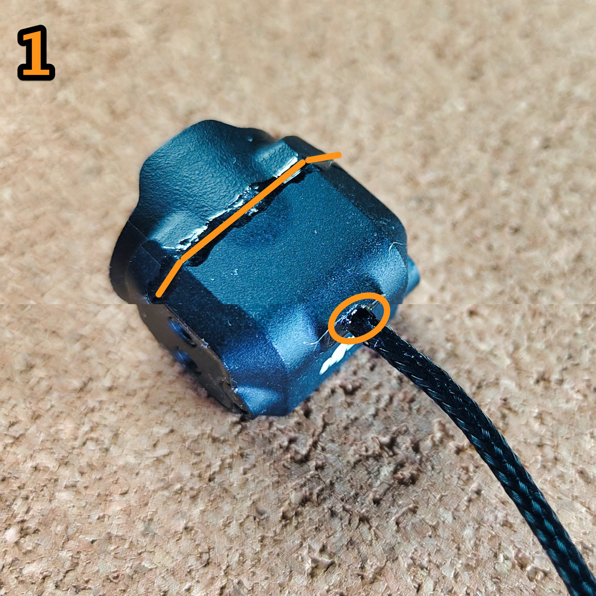
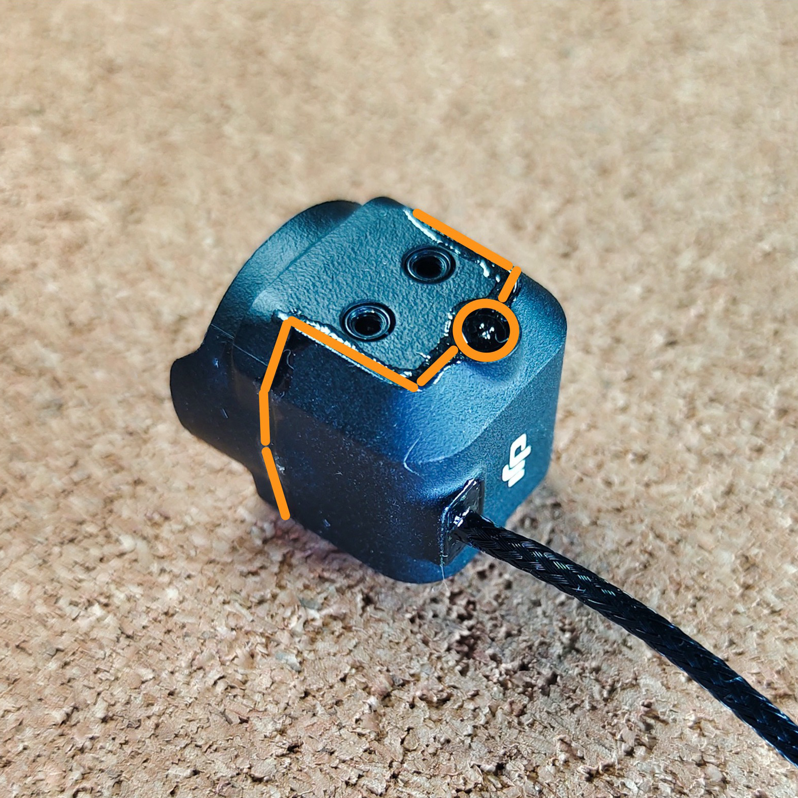
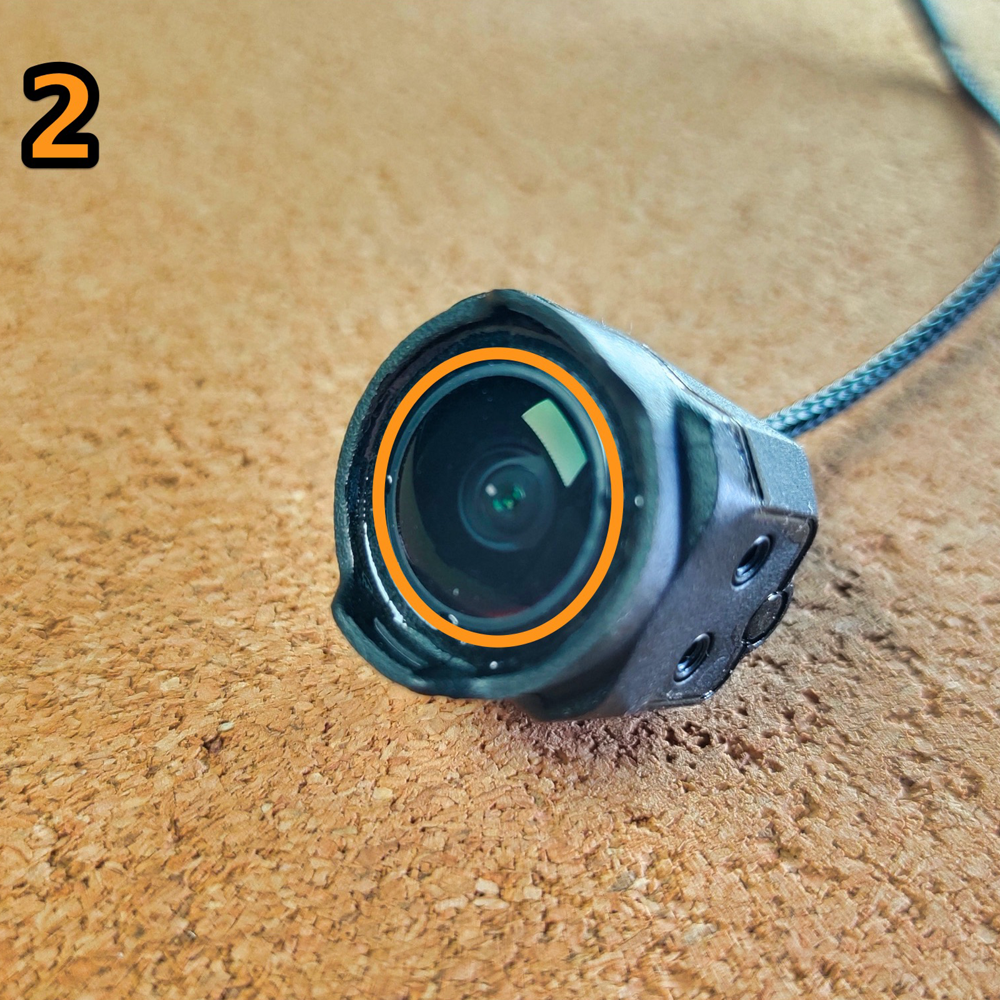
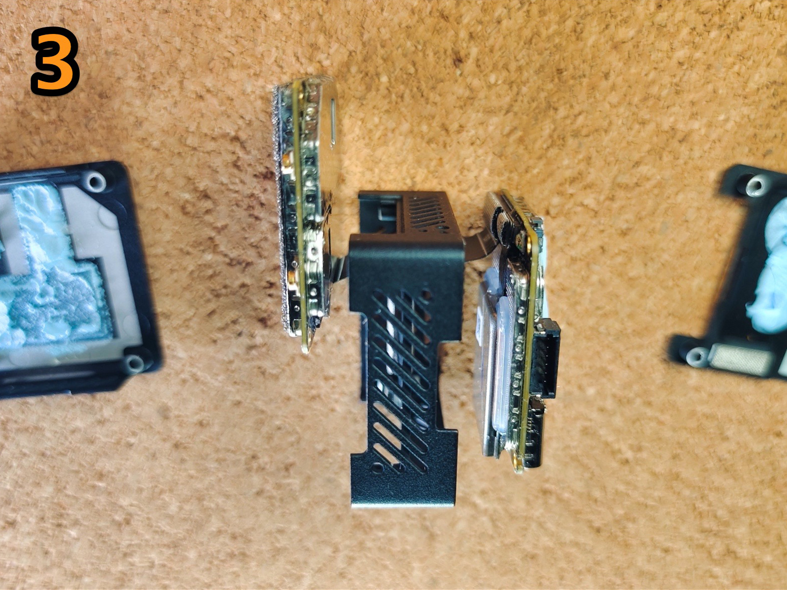
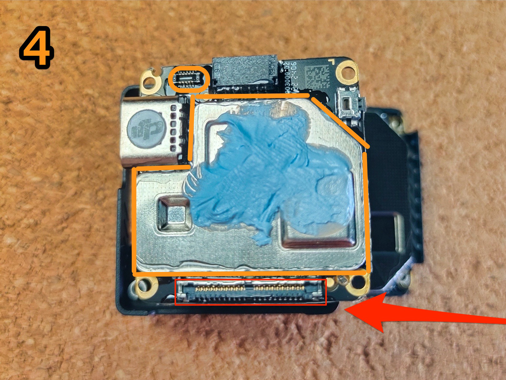
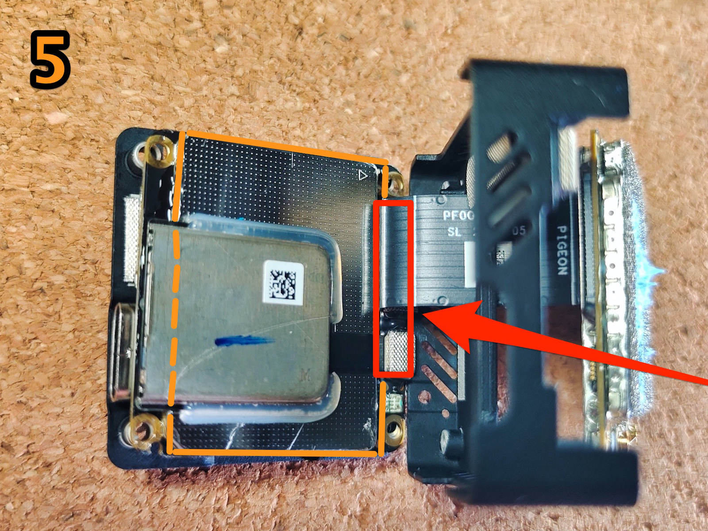
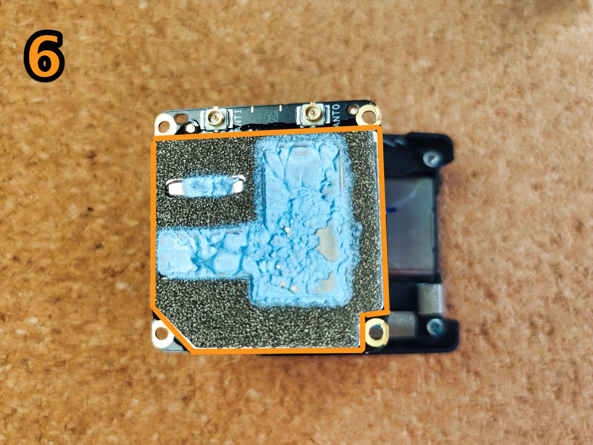
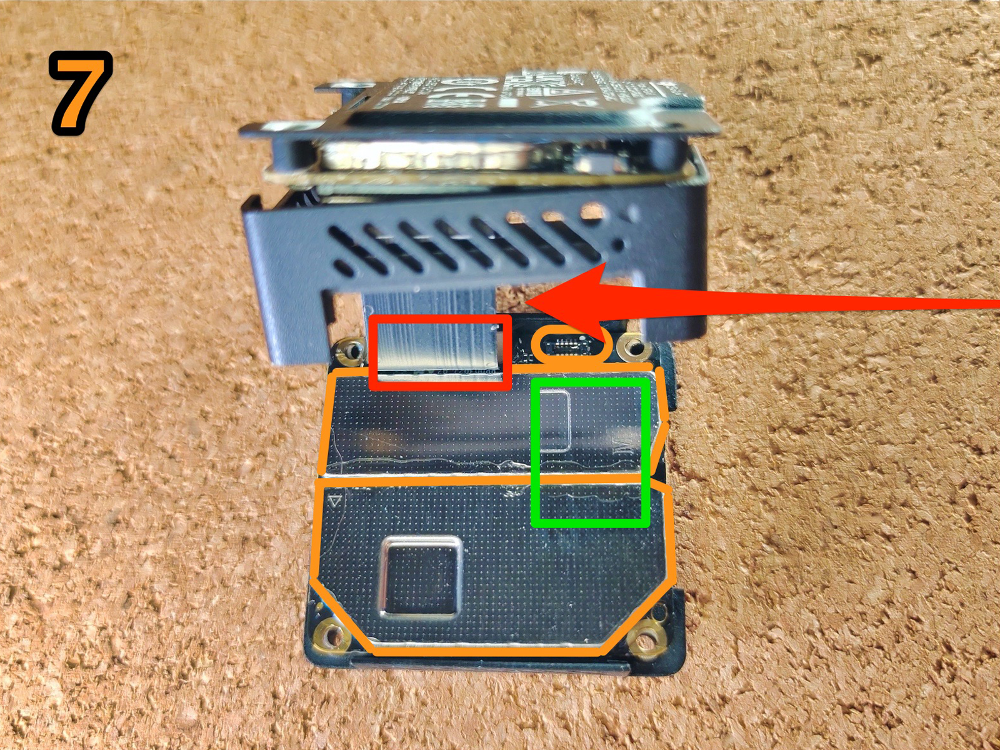

# влагозащита o3 Air Unit
<a href="https://t.me/shtarkfpv/64" target="_blank">оригинальная статья</a>

!!! danger ""
    Все манипуляции вы делаете на свой страх и риск. Данный мануал для тех, кто сомневается как именно и что именно покрывать от влаги.

Идеально загерметить О3 не получится, т.к, unit сильно греется (ему нужно охлаждаться) + есть коннекторы, в которые недопустимо попадание клея.

В данном примере использовался B7000.

## o3 камера

### шаг 1
Нанести тонкий слой по соединительному контуру крышки камеры.
=== "шаг 1.1"
    <figure markdown="span">
        { width="100%" loading=lazy }
        <figcaption>шаг 1.1</figcaption>
    </figure>
=== "шаг 1.2"
    <figure markdown="span">
        { width="100%" loading=lazy }
        <figcaption>шаг 1.2</figcaption>
    </figure>
### шаг 2
Нанести тонкий слой по контуру линзы объектива, так как там сквозная щель, идущая до платы камеры. И которая со временем станет «пыле-влаго-сборником».
<figure markdown="span">
    { width="100%" loading=lazy }
    <figcaption>шаг 2</figcaption>
</figure>

## o3 unit
### шаг 3
Если снять обе крышки с unit'a, то можно, аккуратно отогнув шлейф на 90 градусов, получить доступ к платам.
!!! danger ""
    Все манипуляции со шлейфом нужно делать максимально осторожно!
<figure markdown="span">
    { width="100%" loading=lazy }
    <figcaption>шаг 3</figcaption>
</figure>

### шаг 4
Нанести небольшое количество по контуру изолирующей крышки.
!!! warning ""
    Выделено красным - не допускать попадания на коннектор камеры!
<figure markdown="span">
    { width="100%" loading=lazy }
    <figcaption>шаг 4</figcaption>
</figure>

### шаг 5
Нанести небольшое количество по контуру изолирующей крышки и под слотом SD карты (выделено пунктиром).
!!! warning ""
    С этой стороны платы не допускать попадания в SD-слот, а также не покрывать область - где оба коннектора (помечено красным).
<figure markdown="span">
    { width="100%" loading=lazy }
    <figcaption>шаг 5</figcaption>
</figure>

### шаг 6
!!! question ""
    Перед следующими действиями - лучше дать один час просохнуть первой плате, чтобы не приклеивалась к корпусу, т.к. необходимо сдвинуть корпус по шлейфу для доступа ко второй плате.
Верхняя часть радиомодуля покрывается просто по контуру.
!!! warning ""
    Не допускайте попадание герметика в антенные u.fl коннекторы!
<figure markdown="span">
    { width="100%" loading=lazy }
    <figcaption>шаг 6</figcaption>
</figure>

### шаг 7
Нижняя часть радиомодуля покрывается также по контурам крышек, исключая область межплатного шлейфа.
!!! warning ""
    Не покрывать область где подключается межплатный шлейф (помечено красным).
<figure markdown="span">
    { width="100%" loading=lazy }
    <figcaption>шаг 7</figcaption>
</figure>

!!! question ""
    Отсутствующая на фото наклейка - снимается легко пинцетом, и также легко ставится на место после высыхания герметика.

Дать высохнуть в открытом состоянии пару часов и можно собирать