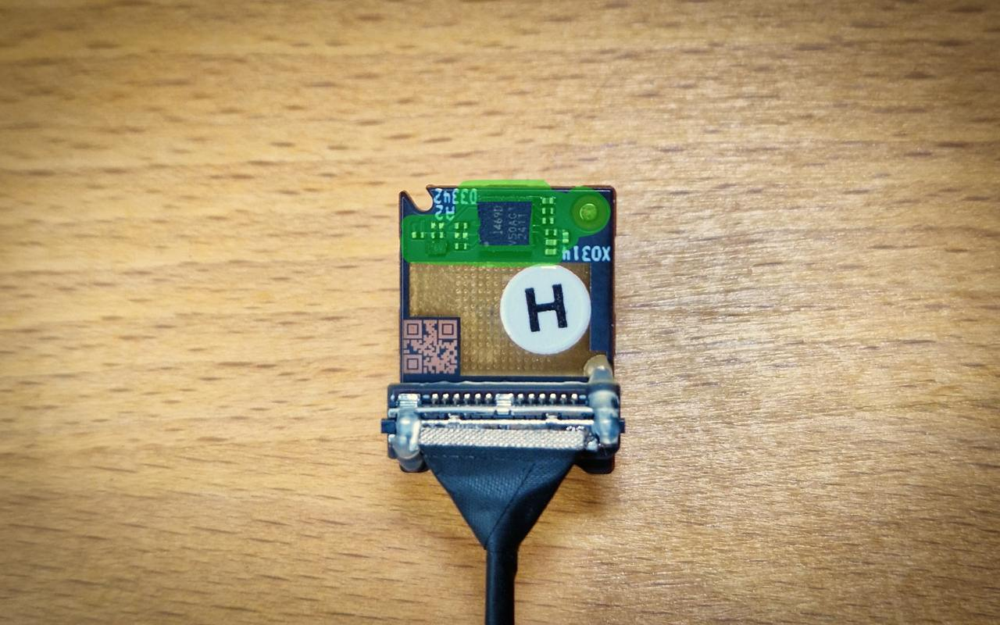
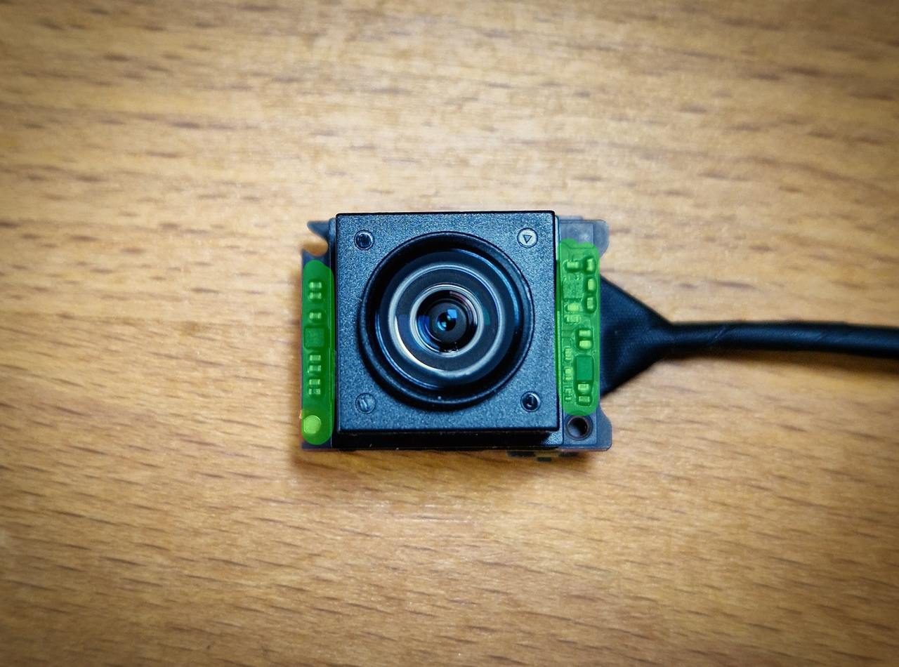
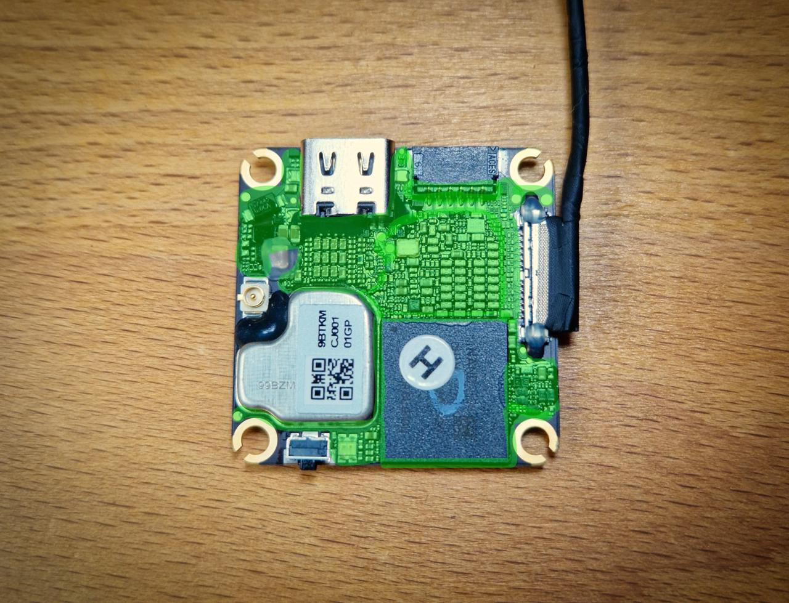
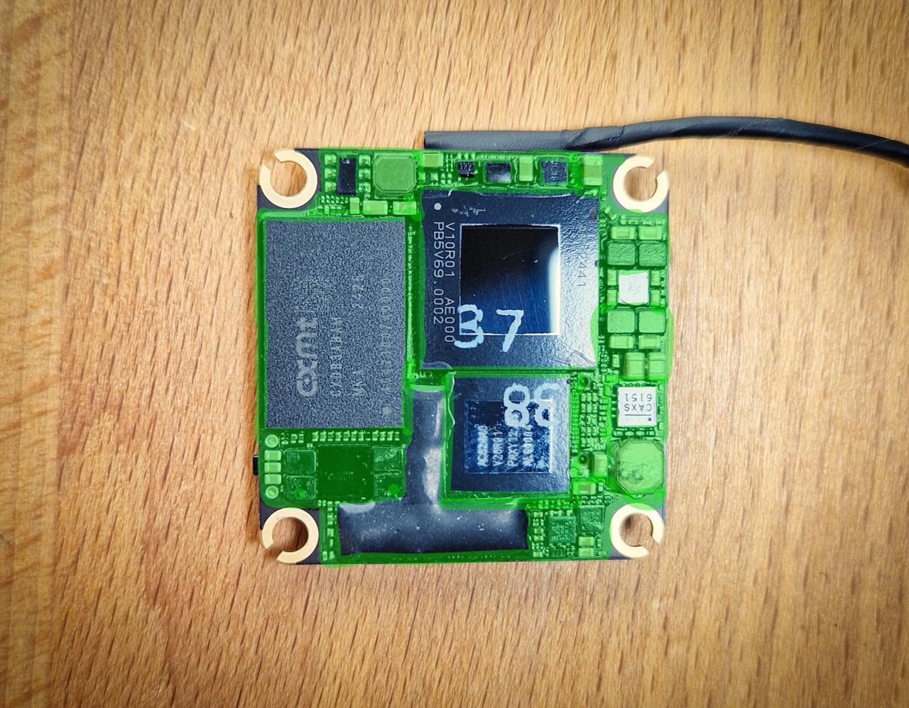

# влагозащита o4 Air Unit (lite)

<a href="https://t.me/shtarkfpv/362" target="_blank">оригинальная статья</a>

!!! danger ""
    Все манипуляции вы делаете на свой страх и риск. Данный мануал для тех, кто сомневается как именно и что именно покрывать от влаги.

С завода плата О4 покрыта лаком, но есть непокрытые места (например под BGA чипами есть зазоры), а также лак имеет свойство трескаться под воздействием микро-деформаций платы. 

В данном примере использовался B7000 (Zhanlida). Тюбик должен быть свежим, и клей должен легко выдавливаться. Ключевой подход - не "заливать" плату клеем, а наносить тонким слоем. 

!!! warning ""
    Избегайте попадания клея на разъемы, кнопки, и внутрь коннекторов.
Зеленым помечены области для герметзации.

## o4 камера
### шаг 1
<figure markdown="span">
    { width="100%" loading=lazy }
    <figcaption>задняя часть камеры</figcaption>
</figure>

### шаг 2
<figure markdown="span">
    { width="100%" loading=lazy }
    <figcaption>передняя часть камеры</figcaption>
</figure>

## o4 unit
### шаг 3
<figure markdown="span">
    { width="100%" loading=lazy }
    <figcaption>верхняя часть юнита</figcaption>
</figure>

### шаг 4
<figure markdown="span">
    { width="100%" loading=lazy }
    <figcaption>нижняя часть юнита</figcaption>
</figure>