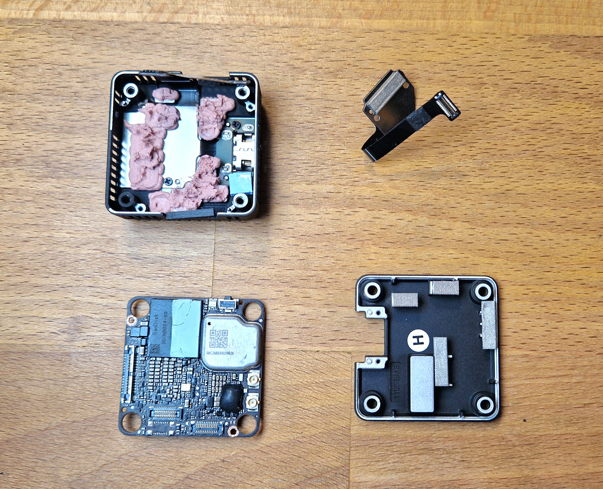

# влагозащита o4 Air Unit Pro

<a href="https://t.me/shtarkfpv/374" target="_blank">оригинальная статья</a>

  

  

!!! danger ""
    Все манипуляции вы делаете на свой страх и риск. Данный мануал для тех, кто сомневается как именно и что именно покрывать от влаги.

С завода плата О4 покрыта лаком, но есть непокрытые места (например под BGA чипами есть зазоры), а также лак имеет свойство трескаться под воздействием микро-деформаций платы. 

В данном примере использовался B7000 (Zhanlida). Тюбик должен быть свежим, и клей должен легко выдавливаться. Ключевой подход - не "заливать" плату клеем, а наносить тонким слоем. 

!!! warning ""
    Избегайте попадания клея на разъемы, кнопки, и внутрь коннекторов.

Зеленым помечены области для герметзации.

!!! tip ""
    Юнит нужно разобрать до состояния на фото. Остатки термопасты с платы нужно переместить на крышку. И перед нанесением Б7000 желательно обезжирить плату спиртом. 
    <figure markdown="span">
        { width="100%" .on-glb }
        <figcaption>разобранный o4 pro</figcaption>
    </figure>

## o4 Pro камера
### точки нанесения

  

  

  

### результат

  

  

## o4 Pro Air unit
### точки нанесения

  

  

  

### результат

  

  

  

После завершения - дать высохнуть 2-3 часа и собрать юнит.