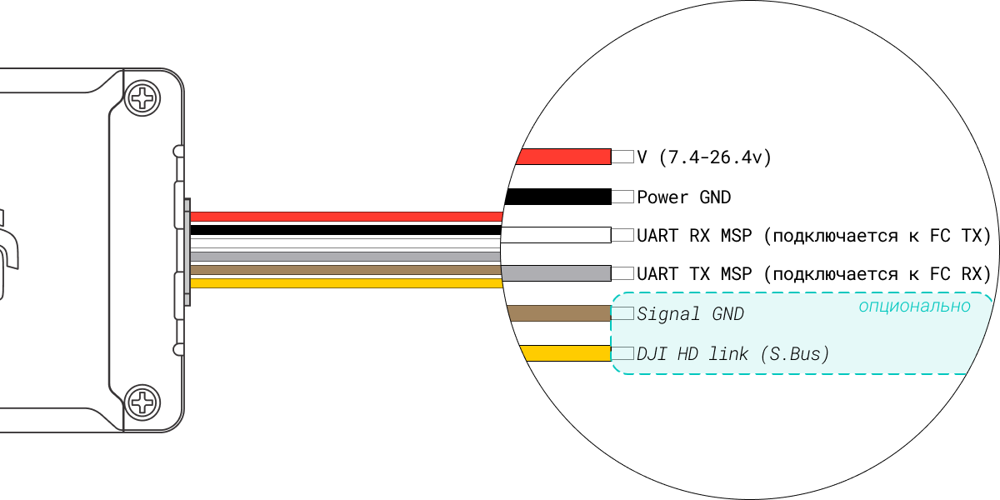

## какие лимиты дальности?
!!! tip ""
    | Air Unit                     |             FPV Goggles |       FPV Goggles V2 |       Goggles 2/Integra |       Goggles 3 |       Goggles N3 |
    |:-----------------------------|------------------------:|----------------------:|-------------------------:|-----------------:|------------------:|
    |     FPV Air Unit/Caddx Vista |                 13.4км |               13.4км |                    30км |              ❌ |               ❌ |
    |     o3 Air Unit              |                    ❌ |               23.4км |                  23.4км |           25.5км[^1] |               ❌ |
    |     o4 Air Unit              |                    ❌ |                  ❌ |                  25.5км |           25.5км |            25.5км |
    |     o4 Air Unit Pro          |                    ❌ |                  ❌ |                  25.5км |           28.3км |            28.3км |

[^1]: по Goggles 3 + o3 Air Unit информация не подтверждена

## что с чем совместимо?
!!! tip ""
    см. [общая таблица совместимости](compatibility.md#общая-таблица-совместимости)

## какой ассистент нужен?
!!! tip ""
    см. [DJI Assistant 2](dji_assistant.md)

    !!! note "если у тебя первое поколение железа:"

        * DJI Air Unit
        * Caddx Vista
        * DJI FPV Goggles
        * DJI FPV Goggles V2

        скачивай [DJI Assistant 2 (DJI FPV series)](dji_assistant.md#dji-assistant-2-dji-fpv-series)

    !!! note "если у тебя второе и выше поколение железа:"

        * DJI o3 Air Unit
        * DJI o4 Air Unit
        * DJI o4 Air Unit Pro
        * DJI Goggles 2
        * DJI Goggles Integra
        * DJI Goggles 3
        * DJI Goggles N3

        скачивай [DJI Assistant 2 (Consumer Drone Series)](dji_assistant.md#dji-assistant-2-consumer-drone-series)

## можно ли заменить антенны на очках?
!!! tip ""
    | очки                   | возможность замены антенн   | разъём   |
    |:-----------------------|------------------------------:|--------------:|
    | DJI FPV Goggles        | да, все четыре                | RP-SMA        |
    | DJI FPV Goggles V2     | да, все четыре                | RP-SMA        |
    | DJI Goggles 2          | да, две внешние               | MCX           |
    | DJI Goggles Integra    | ❌                            | ❌            |
    | DJI Goggles 3          | ❌                            | ❌            |
    | DJI Goggles N3         | ❌                            | ❌            |

## какой разъём антенны на юните?
!!! info "MMCX"
    * DJI FPV Air Unit
!!! info "U.FL"
    * Caddx Vista
    * o3 Air Unit
    * o4 Air Unit
    * o4 Air Unit Pro

    !!! note ""
        он же I-PEX MHF I, IPEX1, IPX1, MHF, MHF I, MHF1, AMC, MCRF, GS, TXR, UM, UMC, UMCX, ultra-miniature coaxial
## какой разъем антенны на очках
!!! tip ""
    см.[можно ли заменить антенны на очках?](#можно-ли-заменить-антенны-на-очках)

## как сделать хак?
!!! tip ""
    см. [FCC hack](fcc.md#fcc-hack)

## как настроить OSD?
!!! tip ""
    см. [Настройка OSD](osd.md#настройка-osd)

## можно ли заменить coaxial шлейфы o4 и o4 pro?
!!! success "можно"
    они одинаковые по распиновке

## можно ли записывать OSD на DVR в очках?
!!! failure "нельзя - на старом поколении очков:"

    * FPV Goggles (V1)
    * FPV Goggles V2

!!! success "можно - на новом поколении очков:"

    * Goggles 2
    * Goggles Integra
    * Goggles 3
    * Goggles N3

    !!! warning ""
        в Goggles 2 + Goggles Integra настройка отсутствует при работе с DJI FPV Air Unit и Caddx Vista  если вы хотите включить или отключить запись OSD на DVR очков -  переключитесь в режим о3, проведите манипуляции с настройками и это так же применится на работу с первым поколением юнитов

    === "RU"
        настройки → камера → расширенные настройки камеры → запись обзора камеры :material-toggle-switch-outline:

    === "EN"
        settings → camera → advanced camera settings → camera view record :material-toggle-switch-outline:

## какие настройки нужны для стабилизации видео в Gyroflow?
!!! tip ""
    * отключить внутреннюю стабилизацию RockSteady (EIS)
    * установить угол камеры широкий/wide
    !!! warning "не ищите отдельный файл с данными гироскопа"
        в случае корректных настроек он будет встроен в видео

## что за .LRF файлы и можно ли их отключить?
!!! failure "нельзя"
    * файлы .LRF автоматически создаются при записи видео и используются для предварительного просмотра
    * опции включения/отключения нет
    * так же в настоящий момент нет четкого понимания в каком случае они пишутся, а в каком нет

## как подключить юнит к полетному контроллеру?
!!! tip ""
    * согласно схеме подключения (wiring diagram) для вашего полетного контроллера
    === "FPV Air Unit"
        <figure markdown="span">
        { width="100%" .on-glb }
        <figcaption>FPV Air Unit wiring</figcaption>
        </figure>
    === "Caddx Vista"
        <figure markdown="span">
        { width="100%" .on-glb }
        <figcaption>Caddx Vista wiring</figcaption>
        </figure>
    === "o3 Air Unit"
        <figure markdown="span">
        { width="100%" .on-glb }
        <figcaption>o3 Air Unit wiring</figcaption>
        </figure>
    === "o4 Air Unit"
        <figure markdown="span">
        { width="100%" .on-glb }
        <figcaption>o4 Air Unit wiring</figcaption>
        </figure>
    === "o4 Pro Air Unit"
        <figure markdown="span">
        { width="100%" .on-glb }
        <figcaption>o4 Pro Air Unit wiring</figcaption>
        </figure>

## как активировать юнит?
!!! tip ""
    - установить нужный DJI Assistant 2
        - см. [какой ассистент нужен](dji_assistant.md)
    - возможность активировать появистя согласно особенностям конкретного юнита:
        - DJI FPV Air Unit
            - :material-battery-plus-outline:{ .red_cross } необходимо внешнее питание для прошивки и активации
        - Caddx Vista
            - :material-battery-plus-outline:{ .red_cross } необходимо внешнее питание для прошивки и активации
        - DJI o3 Air Unit
            - :material-usb-c-port:{ .green_check } для прошивки и активации достаточно питания от USB
        - DJI o4 Air Unit
            - :material-usb-c-port:{ .green_check } для прошивки достаточно питания от USB
            - :material-battery-plus-outline:{ .red_cross } для активации необходимо внешнее питание
        - DJI o4 Pro Air Unit
            - :material-usb-c-port:{ .green_check } для прошивки достаточно питания от USB
            - :material-battery-plus-outline:{ .red_cross } для активации необходимо внешнее питание