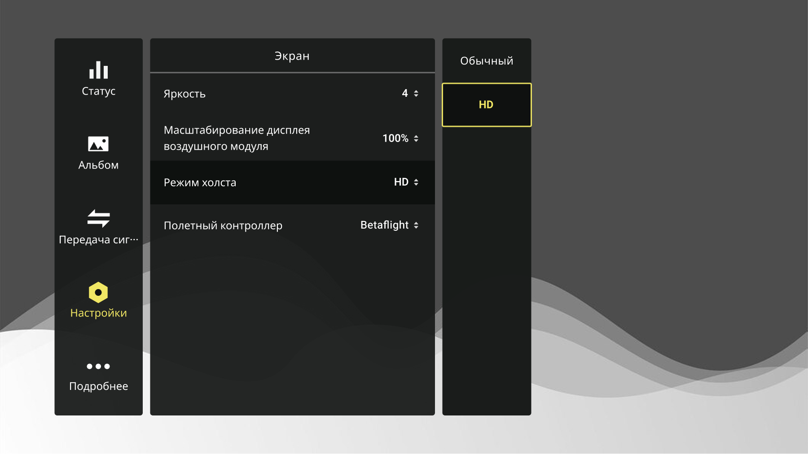
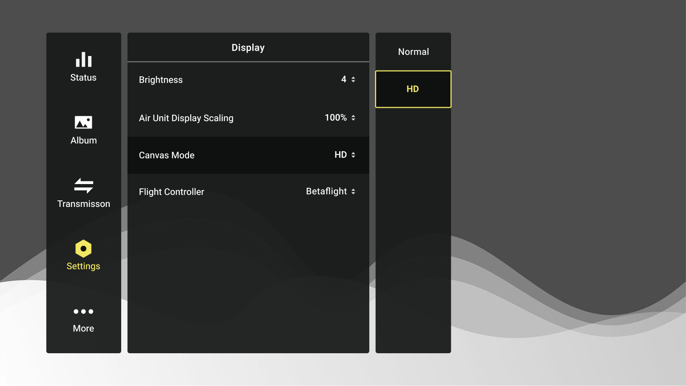
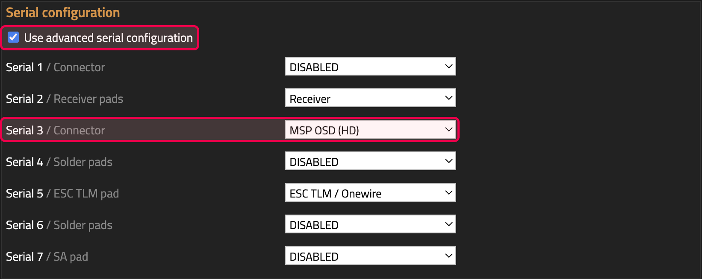
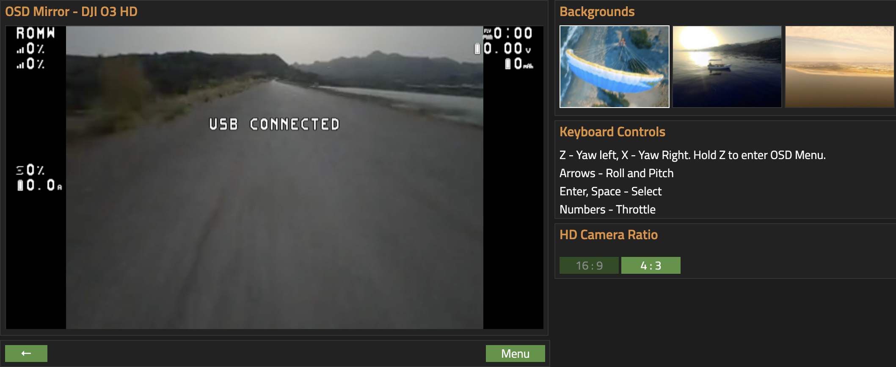

# Настройка OSD

!!! abstract "замечание"

    <p>на текущий момент здесь описаны настройки для актуальных версий полетных контроллеров + очков, которые могут нативно отображать полноценное HD OSD
    <p>легаси настройки + настройки девайсов с WTFOS будут добавлены чуть позже

## физическое подключение юнита

Подключите видеопредатчик к полетному контроллеру согласно инструкции полетного контроллера:

- видеопередатчик TX :material-arrow-right: RX полетный контроллер
- видеопередатчик RX :material-arrow-left: TX полетный контроллер

## настройка очков
в меню очков нужно выбрать режим холста HD
=== "язык интерфейса: русский"
    - Настройки :material-arrow-right: Экран :material-arrow-right: Режим холста :material-arrow-right: HD
    <figure markdown="span">
    { width="100%" .on-glb }
    <figcaption>выбор опции в очках</figcaption>
    </figure>
=== "язык интерфейса: english"
    - Settings :material-arrow-right: Display :material-arrow-right: Canvas Mode :material-arrow-right: HD
    <figure markdown="span">
    { width="100%" .on-glb }
    <figcaption>выбор опции в очках</figcaption>
    </figure>

## настройки в зависимости от софта полетного контроллера:

### Betaflight

1. #### Ports.MSP 
    во вкладке портов ниобходимо активировать MSP на том порту, куда подключены RX и TX видеопередатчика
    <figure markdown="span">
    { width="100%" .on-glb }
    { width="100%" .on-glb }
    <figcaption>Betaflight Ports MSP </figcaption>
    </figure>
2. #### Ports.Peripherials 
    начиная с версии Betaflight 4.4 небходимо выбрать в колонке периферия опцию VTX(MSP+Displayport)
    <figure markdown="span">
    { width="100%" .on-glb }
    { width="100%" .on-glb }
    <figcaption>выбор опции в периферии</figcaption>
    </figure>
    - [опционально] можно проверить в консоли, что опция MSP+Displayport включилась корректно
        - введите следующую команду в консоль Betaflight конфигуратора 
        ``` title='Betaflight CLI'
        get display
        ```
        - проверьте полученный ответ на команду:
        === "правильный ответ консоли"
            ``` hl_lines="5"
            # get display
            vbat_display_lpf_period = 30
            Allowed range: 1 - 255

            osd_displayport_device = MSP
            Allowed values: NONE, AUTO, MAX7456, MSP, FRSKYOSD

            displayport_msp_col_adjust = 0
            Allowed range: -6 - 0

            displayport_msp_row_adjust = 0
            Allowed range: -3 - 0

            displayport_msp_fonts = 0,1,2,3
            Array length: 4

            displayport_msp_use_device_blink = OFF
            Allowed values: OFF, ON
            ```
        === "неправильный ответ консоли"
            ``` hl_lines="5"
            # get display
            vbat_display_lpf_period = 30
            Allowed range: 1 - 255

            osd_displayport_device = AUTO
            Allowed values: NONE, AUTO, MAX7456, MSP, FRSKYOSD
            Default value: MSP

            displayport_msp_col_adjust = 0
            Allowed range: -6 - 0

            displayport_msp_row_adjust = 0
            Allowed range: -3 - 0

            displayport_msp_fonts = 0,1,2,3
            Array length: 4

            displayport_msp_use_device_blink = OFF
            Allowed values: OFF, ON
            ```
        - если вы видите __osd_displayport_device = AUTO__ исправить можно через консоль, введите следующую команду:
        ``` title='Betaflight CLI'
        set osd_displayport_device = MSP
        ```
        - не забывайте сохранить новые настройки:
        ``` title='Betaflight CLI'
        save
        ```
3. #### OSD

Betaflight конфигуратор :material-arrow-right: OSD :material-arrow-right: установите опцию HD
    <figure markdown="span">
    { width="100%" .on-glb }
    { width="100%" .on-glb }
    <figcaption>HD OSD</figcaption>
    </figure>

### KISS Ultra

!!! example "info"
    DJI не поддерживает нативные шрифты Ultra, на текущий момент актуальное поколение железа DJI из коробки в связке с Ultra работает с таблицей символов Betaflight версии 4.4 (включая HD шрифты)


1. #### Advanced.Serial Configuration
    - Во вкладке Advanced активируйте :material-checkbox-marked-outline: «Use advanced serial configuration» в блоке Serial Configuration
    - на нужном порту выберите из выпадающего списка MSP OSD (HD)
    <figure markdown="span">
    { width="100%" .on-glb }
    <figcaption>Ultra Serial Configuration</figcaption>
    </figure>

2. #### Advanced.MSP OSD
    - Во вкладке Advanced выберите DJI o3 HD в блоке MSP OSD
    <figure markdown="span">
    { width="100%" .on-glb }
    <figcaption>Ultra Serial Configuration</figcaption>
    </figure>

3. #### OSD Mirror
    - сохраните необходимый набор элементов в OSD Mirror на вкладке OSD
    
    <figure markdown="span">
    { width="100%" .on-glb }
    <figcaption>Ultra Serial Configuration</figcaption>
    </figure>