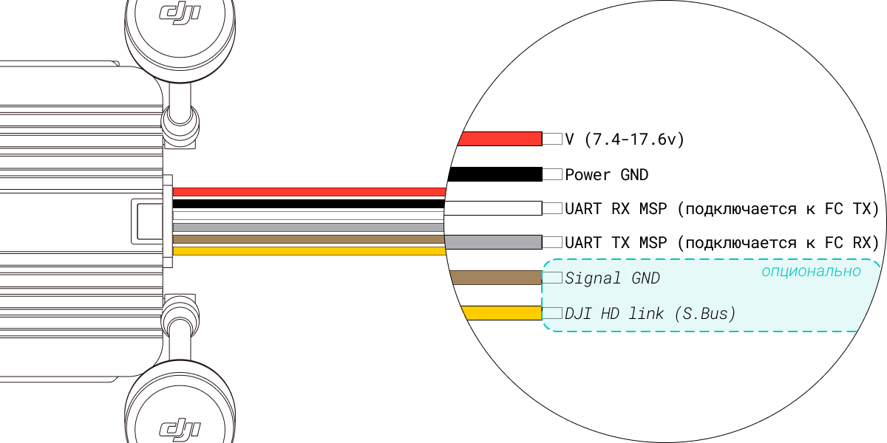

---
tags:
  - p1
  - first_gen
  - wtfos
  - vtx
title: DJI FPV Air Unit
description: Актуальная прошивка, спеки, совместимость
glightbox: true
---
# DJI FPV Air Unit
<figure markdown="span">
  { width="50%" }
  { width="50%" }
  <figcaption>DJI FPV Air Unit</figcaption>
</figure>

### дата релиза
- 2019-07-31

### актуальная прошивка
!!! danger ""
    :material-battery-plus-outline:{ .red_cross } для прошивки и активации необходимо внешнее питание 

* _для работы с очками FPV Goggles V1 и V2_
    * v01.00.0608
* _для работы с очками Goggles 2 и Integra_
    * v01.01.0000
    * рекомендуемый софт для прошивки - <a href="https://www.dji.com/downloads/softwares/dji-assistant-2-dji-fpv-series" target="_blank">DJI Assistant 2 (DJI FPV Series):octicons-link-external-16:</a>
        * [зеркало](https://www.djifpv.ru/knowledge_base/dji_assistant/#dji-assistant-2-dji-fpv-series) :material-file-download-outline:

### ключевые параметры
??? abstract "список параметров"
    1. **Вес**
        - Air Unit (включая модуль камеры, без антенны): ~45.8г
        - Антенна: ~3-4 г
    2. **Размеры**
        - передатчик: 44×37.8×14.4 мм
    3. **Частота**
        - 5.725–5.850 ГГц (Tx/Rx)
    4. **Мощность передачи (EIRP)**
        - <30 dBm (SRRC/FCC)
        - <14 dBm (CE)
    5. **Формат передачи видео в очки**
        - на прошивке v01.00.06.08 для работы с FPV Goggles V1 и V2
            - 720@60/120fps
        - на прошивке v01.01.00.00 для работы с Goggles 2 и Integra
            - -\\-
    6. **Каналы**
        - на прошивке v01.00.06.08 для работы с FPV Goggles V1 и V2
            - 8 каналов при 25 Мбит/с (7 полноценных + 1 паблик)
            - 4 канала при 50 Мбит/с (3 полноценных + 1 паблик)
        - на прошивке v01.01.00.00 для работы с Goggles 2 и Integra
            - авто
            - ручной режим:
                - 40 MHz: 3 канала
                - 20 MHz: 7 каналов
                - 10 MHz: 7 каналов
    7. **запись dvr на vtx**
        - 1080p[^1]/720p[^2]
    8. **Питание**
        - 7.4-17.6v

### совместимость
* Очки:
    * :material-link:{ .green_check } DJI FPV Goggles[^3]
    * :material-link:{ .green_check } DJI FPV Goggles V2[^4]
    * :material-link:{ .green_check } DJI Goggles 2[^5]
    * :material-link:{ .green_check } DJI Goggles Integra[^6]
    * :material-link-off:{ .red_cross } DJI Goggles 3
    * :material-link-off:{ .red_cross } DJI Goggles N3
* апппаратура управления:
    * :material-link:{ .green_check } FPV Remote Controller[^7] 
    * :material-link:{ .green_check } FPV Remote Controller 2[^8]
    * :material-link-off:{ .red_cross } FPV Remote Controller 3
* модификация прошивки
    * :material-link:{ .green_check } WTFOS

### схема подключения

распиновкa DJI FPV Air Unit

<figure markdown="span">
{ width="100%" .on-glb }
<figcaption>FPV Air Unit wiring</figcaption>
</figure>

[^1]: только при работе с камерами без ограничений
[^2]: при работе со сторонними камерами типа Caddx Polar или Runcam Wasp
[^3]: на прошивке v01.00.06.08
[^4]: на прошивке v01.00.06.08
[^5]: на прошивке v01.01.00.00
[^6]: на прошивке v01.01.00.00
[^7]: только при работе с очками FPV Goggles V1 и V2, на прошивке v01.00.06.08
[^8]: только при работе с очками Goggles 2 и Integra, на прошивке v01.01.00.00