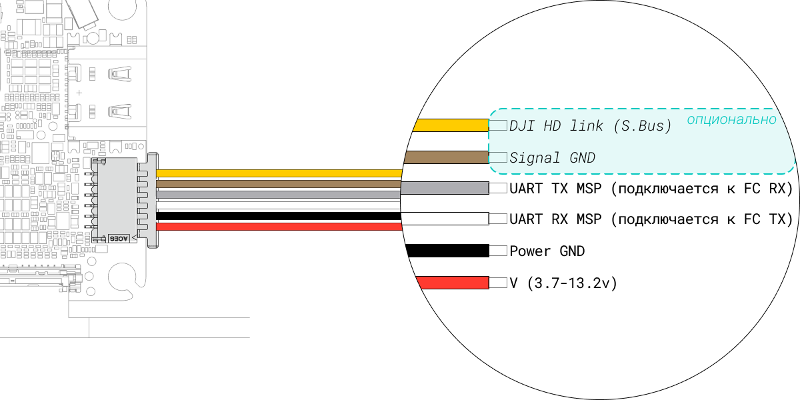

---
tags:
  - s2
  - e3t
  - third_gen
  - vtx
title: DJI o4 Air Unit
description: Актуальная прошивка, спеки, совместимость
---
# DJI o4 Air Unit
<figure markdown="span">
  { width="50%" }
  { width="50%" }
  <figcaption>DJI o4 Air Unit</figcaption>
</figure>

### дата релиза
- 2025-01-09

### актуальная прошивка
!!! danger ""
    :material-battery-plus-outline:{ .red_cross } для активации и калибровки камеры, в случае замены, необходимо внешнее питание
!!! success ""
    :material-usb-c-port:{ .green_check } для прошивки достаточно питания от USB

- v01.00.0300
- рекомендуемый софт для прошивки - <a href="https://www.dji.com/downloads/softwares/dji-assistant-2-consumer-drones-series" target="_blank">DJI Assistant 2 (Consumer Drones Series):octicons-link-external-16:</a>
    - [зеркало](https://www.djifpv.ru/knowledge_base/dji_assistant/#dji-assistant-2-consumer-drone-series) :material-file-download-outline:

### официальные инструкции от  DJI

см. [туториалы](https://www.djifpv.ru/knowledge_base/dji_tutorials/)

### ключевые параметры
??? abstract "список параметров"
    1. **Вес**
        - Air Unit (без модуля камеры): 5.1 гр
        - Air Unit (включая модуль камеры): 8.2 гр
        - антенна: ~0.75 гр
    2. **Размеры**
        - передатчик: 30×30×6 мм
        - камера: 13.44×12.36×16.50 мм
        - коаксиальный кабель: 50 мм
        - 6 pin кабель к полетнику: 50 мм
        - антенна: 80 мм
    3. **Частота**
        - 5.170-5.250 ГГц [^1]
        - 5.725-5.850 ГГц
    4. **Мощность передачи (EIRP[^2])**
        - <30 dBm (FCC) ~1Вт
    5. **Формат передачи видео в очки**
        - 1080P@30/50/60/100fps
    6. **Каналы**
        - авто
        - ручные настройки:
            - при работе с DJI Goggles 3 или DJI Goggles N3:
            - 60/40/20/10 MHz
            - при работе с DJI Goggles 2 или Goggles Integra：
            - 40/20/10 MHz
    6. **Сенсор**
        - 1/2 дюйма CMOS сенсор
    7. **Линза**
        - FOV: 117.6°
        - The equivalent focal length: 14 mm
        - Aperture: f/2.8
        - Focus: 0.6 m to ∞ 
    8. **Диапазон ISO**
        - 100-6400 (авто)
        - 100-12800 (ручная настройка)
    9. **Разрешение видео**
        - 4K (4:3): 3840×2880@30/50/60fps
        - 4K (16:9): 3840×2160@30/50/60fps
        - 1080p (4:3): 1440×1080@30/50/60/100/120fps
        - 1080p (16:9): 1920×1080@30/50/60/100/120fps
    10. **Формат видео**
        - MP4
    11. **Максимальный битрейт видео**
        - 100  Mbps
    12. **Цветовые режимы**
        - Normal Mode
    13. **Настраиваемая ширина угла камеры**
        - Standard
        - Wide-Angle
    14. **Стабилизация изображения**
        - RockSteady 3.0+[^3]
        - Stabilization function off (supports Gyroflow)
    15. **Диапазон питания o4 Air Unit**
        - 3.7-13.2 V
    16. **Поддерживаемые карты памяти**
        - нет 
    17. **Объем встроенной памяти**
        - 23GB

### совместимость
* очки:
    * :material-link-off:{ .red_cross } DJI FPV Goggles
    * :material-link-off:{ .red_cross } DJI FPV Goggles V2
    * :material-link:{ .green_check } DJI Goggles 2[^4]
    * :material-link:{ .green_check } DJI Goggles Integra[^5]
    * :material-link:{ .green_check } DJI Goggles 3
    * :material-link:{ .green_check } DJI Goggles N3
* апппаратура управления:
    * :material-link-off:{ .red_cross } FPV Remote Controller 
    * :material-link:{ .green_check } FPV Remote Controller 2[^6]
    * :material-link:{ .green_check } FPV Remote Controller 3[^7]
* модификация прошивки
    * :material-link-off:{ .red_cross } WTFOS

### схема подключения

распиновкa DJI o4 Air Unit

<figure markdown="span">
{ width="100%" .on-glb }
<figcaption>o4 Air Unit wiring</figcaption>
</figure>

[^1]: не для всех регионов
[^2]: EIRP это мощность передатчика за антенной, по методикам определения FCC
[^3]: При включенной стабилизации RockSteady доступен только нормальный (Standard) угол камеры
[^4]: с частично урезанным функционалом в виде отсутствия race mode и 60MHz ширины канала (60Mbit) 
[^5]: с частично урезанным функционалом в виде отсутствия race mode и 60MHz ширины канала (60Mbit) 
[^6]: при работе с очками Goggles 2/Integra
[^7]: при работе с очками Goggles 3/Goggles N3