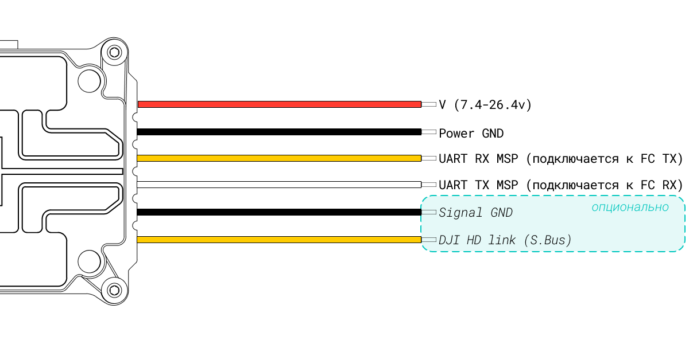

---
tags:
  - p1
  - first_gen
  - wtfos
  - vtx
title: Caddx Vista
subtitle: Air Unit (lite), Runcam Link
description: Актуальная прошивка, спеки, совместимость
---
# Caddx Vista

<figure markdown="span">
  { width="50%" }
  { width="50%" }
  <figcaption>Caddx Vista</figcaption>
</figure>

???+ tip "note"
    так же известная как Air Unit (lite), Runcam Link
    
    не пытайтесь искать разницу, это один и тот же юнит, с одного и того же завода

### дата релиза
- 2020-01-13

### актуальная прошивка
* _для работы с очками FPV Goggles V1 и V2_
    * v01.00.06.08
* _для работы с очками Goggles 2 и Integra_
    * v01.01.00.00
    * рекомендуемый софт для прошивки - <a href="https://www.dji.com/downloads/softwares/dji-assistant-2-dji-fpv-series" target="_blank">DJI Assistant 2 (DJI FPV Series):octicons-link-external-16:</a>
        * [зеркало](https://www.djifpv.ru/knowledge_base/dji_assistant/#dji-assistant-2-dji-fpv-series) :material-file-download-outline:

### ключевые параметры
??? abstract "список параметров"
    1. **Вес**
        - Caddx Vista (включая модуль камеры, без антенны): ~29г
        - вес передатчика без камеры: ~19г
    2. **Размеры**
        - передатчик: 30×29×13 мм
    3. **Частота**
        - 5.725–5.850 ГГц (Tx/Rx)
    4. **Мощность передачи (EIRP)**
        - <30 dBm (SRRC/FCC)
        - <14 dBm (CE)
    5. **Формат передачи видео в очки**
        - на прошивке v01.00.06.08 для работы с FPV Goggles V1 и V2
            - 720@60/120fps
        - на прошивке v01.01.00.00 для работы с Goggles 2 и Integra
            - -\\-
    6. **Каналы**
        - на прошивке v01.00.06.08 для работы с FPV Goggles V1 и V2
            - 8 каналов при 25 Мбит/с (7 полноценных + 1 паблик)
            - 4 канала при 50 Мбит/с (3 полноценных + 1 паблик)
        - на прошивке v01.01.00.00 для работы с Goggles 2 и Integra
            - авто
            - ручной режим:
                - 40 MHz: 3 канала
                - 20 MHz: 7 каналов
                - 10 MHz: 7 каналов
    7. **запись dvr на vtx**
        - нет
    8. **Питание**
        - 7.4-26.4v

### совместимость
* Очки:
    * :material-link:{ .green_check } DJI FPV Goggles[^1]
    * :material-link:{ .green_check } DJI FPV Goggles V2[^2]
    * :material-link:{ .green_check } DJI Goggles 2[^3]
    * :material-link:{ .green_check } DJI Goggles Integra[^4]
    * :material-link-off:{ .red_cross } DJI Goggles 3
    * :material-link-off:{ .red_cross } DJI Goggles N3
* апппаратура управления:
    * :material-link:{ .green_check } FPV Remote Controller[^5] 
    * :material-link:{ .green_check } FPV Remote Controller 2[^6]
    * :material-link-off:{ .red_cross } FPV Remote Controller 3
* модификация прошивки
    * :material-link:{ .green_check } WTFOS
### схема подключения

распиновкa Caddx Vista

<figure markdown="span">
{ width="100%" .on-glb }
<figcaption>Caddx Vista wiring</figcaption>
</figure>

[^1]: на прошивке v01.00.06.08
[^2]: на прошивке v01.00.06.08
[^3]: на прошивке v01.01.00.00
[^4]: на прошивке v01.01.00.00
[^5]: только при работе с очками FPV Goggles V1 и V2, на прошивке v01.00.06.08
[^6]: только при работе с очками Goggles 2 и Integra, на прошивке v01.01.00.00